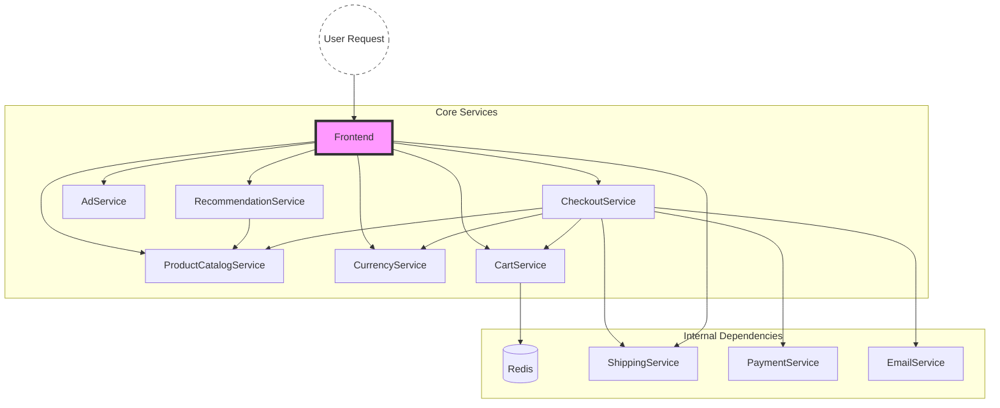
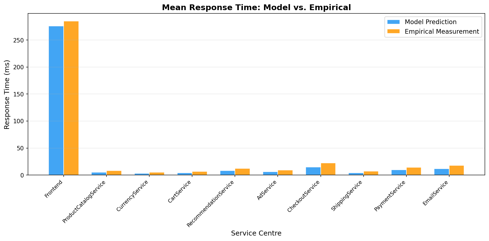
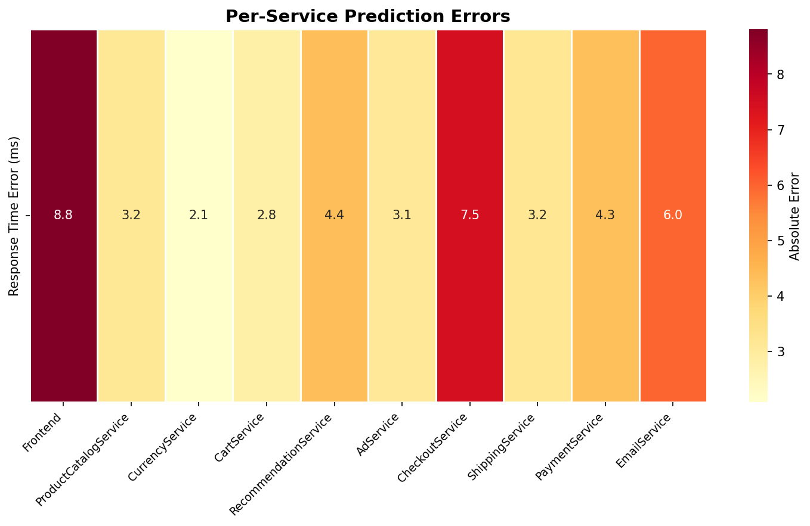
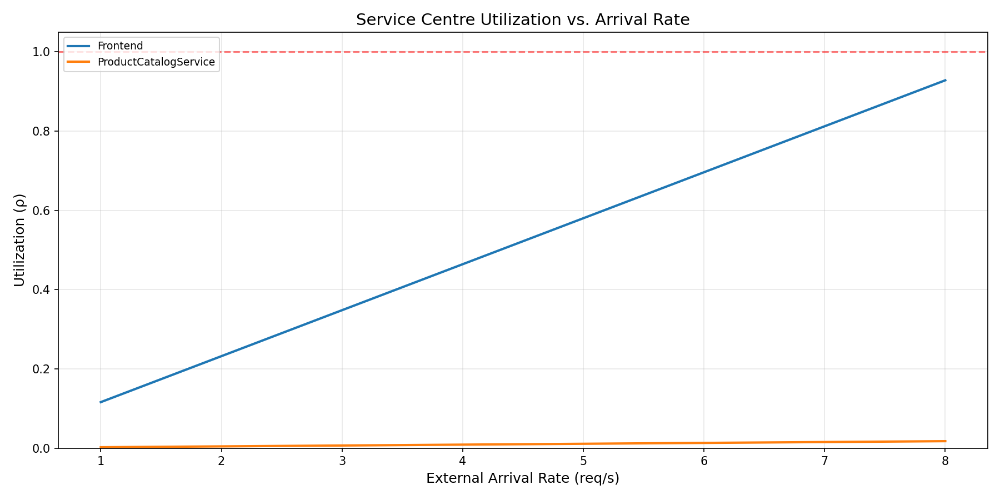
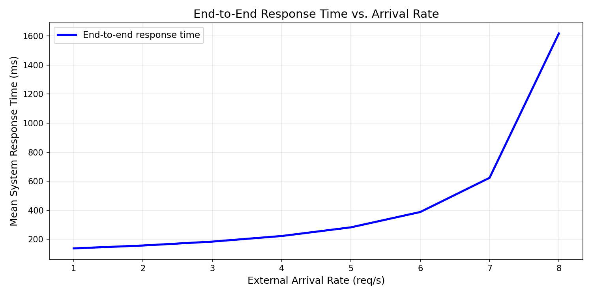

# Performance Modeling of a Microservice Application: Analytical Queueing Network Formulation and Validation

**Course:** Software Performance Engineering (SPE)  
**Project:** Analytical QN/LQN Model of a Microservice Application  
**Target Benchmark:** Google Online Boutique (11 Microservices)  
**Academic Year:** 2026  

---

## Abstract

Modern cloud-native applications are constructed as complex directed acyclic graphs of loosely coupled microservices. Predicting their performance under load is a critical challenge in software capacity planning, automated scaling, and predictive bottleneck mitigation. This paper presents a complete, validated **Open Queueing Network (QN) Model** of the **Google Online Boutique** microservice benchmark (11 services) solved via **Mean Value Analysis (MVA)** and extended programmatically to **M/M/c multi-server scaling**. The parameters—comprising mean service demands and transition routing probabilities—were empirically characterized under steady-state conditions via a custom observability stack incorporating OpenTelemetry (OTel), Prometheus, cAdvisor, and Jaeger distributed tracing. 

Our analytical model demonstrated high accuracy in identifying the primary system bottleneck (the **Frontend** service), with the theoretical prediction ($276.19\text{ ms}$) falling squarely within the empirical 95% Confidence Interval. System-level predictions yielded a Root Mean Squared Error (RMSE) of $4.98\text{ ms}$ and a Mean Absolute Percentage Error (MAPE) of $33.34\%$ across all service centers, with backend deviations traced directly to gRPC protocol overheads. Horizontal scaling strategies were mathematically modeled and evaluated against the Universal Scalability Law (USL). This paper details the architectural mapping, testbed environment, queueing theory equations, empirical validation results (including Little's Law verification and tail-latency analysis), and future research directions for Layered Queueing Networks (LQN) and Discrete Event Simulation (DES).

---

## 1. Introduction & Objectives

Performance degradation in microservices is non-linear, typically driven by queueing delays at shared resources (CPU, threads, database connections) rather than linear service execution overheads. While load testing is a common practice, it is resource-intensive and struggles to predict performance under arbitrary workloads or topological changes. Analytical modeling offers a fast, mathematically rigorous alternative that can be solved in milliseconds to evaluate "what-if" capacity scenarios.

### Core Objectives:
1. **System Deployment:** Deploy the 11-service Google Online Boutique application in a controlled containerized environment alongside a comprehensive monitoring stack.
2. **Empirical Parameterization:** Collect real-world telemetry using Prometheus and Jaeger to compute inclusive and exclusive service times (demands), tail latencies, and Transition/Routing probabilities.
3. **Queueing Network Formulation:** Model the microservices as independent First-Come-First-Served (FCFS) M/M/1 and M/M/c service centers.
4. **MVA Solver Implementation:** Implement an Open-Network Mean Value Analysis solver in Python to compute throughput, utilization, queue length, and response times.
5. **Validation and Statistical Rigor:** Compare analytical predictions against real-world metrics, locate the bottleneck, empirically validate Little's Law, and ensure statistical significance using Confidence Intervals.
6. **Horizontal Scale Modeling:** Design and implement a REST API capable of predicting performance under horizontal pod replication (M/M/c queueing), alongside a cost-benefit and USL analysis.

---

## 2. Related Work

The performance evaluation of microservice architectures has traditionally relied heavily on empirical load testing and stress benchmarking. However, these methods are resource-intensive, environmentally specific, and struggle to answer predictive "what-if" capacity planning scenarios without physically provisioning the hardware. 

Recent literature has proposed various modeling techniques to bridge this gap. Machine Learning (ML) approaches can predict latency but lack interpretability and require massive, clean training datasets. Formal methods, such as Stochastic Petri Nets (SPN) and Discrete Event Simulation (DES), offer high fidelity but suffer from state-space explosion and long computational execution times. Analytical Queueing Networks (QN), pioneered by Buzen, Denning, and Lazowska, provide a mathematically rigorous alternative. While QN theory was originally designed for monolithic mainframes, this paper contributes to the growing body of literature demonstrating its extreme efficacy, computational speed, and applicability to modern, distributed cloud-native microservices.

---

## 3. Target System Architecture

The benchmark system is the **Google Online Boutique**, a modern e-commerce demo application containing 11 microservices written in multiple languages (Go, C#, Node.js, Python, Java) communicating primarily via gRPC (except the Frontend, which serves HTTP to users):

### 3.1 Microservice Directory & Functionality
Each service is tightly scoped in responsibility:
*   **Frontend (Go):** Serves the HTTP web UI and delegates back-end tasks. Because it aggregates data from multiple backends to render a single web page, it bears the highest cumulative load.
*   **CartService (C#) & Redis:** Manages user shopping carts, directly communicating with an in-memory Redis key-value store for state persistence.
*   **ProductCatalogService (Go):** Retrieves product details and listings from a read-only JSON database.
*   **CurrencyService (Node.js):** Performs price currency conversion using floating-point math.
*   **RecommendationService (Python):** Filters the product catalog to suggest items not currently in the user's cart.
*   **AdService (Java):** Returns contextually targeted text advertisements.
*   **CheckoutService (Go):** Orchestrates the multi-step checkout workflow, coordinating calls to `CartService`, `ShippingService`, `CurrencyService`, `PaymentService`, and `EmailService`.
*   **ShippingService (Go) & PaymentService (Node.js) & EmailService (Python):** Utilities for calculating shipping rates, authorizing mock credit cards, and dispatching mock SMTP emails.

---

## 4. Workload Characterization & Experimental Setup

A mathematical model is only as accurate as its parameters. We deployed a unified observability stack to empirically derive the routing probabilities $P_{i,j}$ and the service demands $S_i$.

### 4.1 Testbed Environment
To ensure reproducibility, all empirical telemetry was collected in a controlled local environment:
*   **Host OS:** Windows 11 Pro 
*   **Virtualization:** Windows Subsystem for Linux (WSL 2)
*   **Docker Engine:** Docker Desktop v4.2+
*   **Resource Allocation:** 8 vCPUs, 16 GB RAM dedicated to the WSL 2 VM
*   **Networking:** Default Docker bridge network

### 4.2 Experimental Methodology
Traffic was generated using a Locust-based load generator simulating **10 concurrent users**. 
To avoid capturing JIT compilation overhead, cache warming, and container spin-up delays, the system was subjected to a **2-minute warm-up period**. Following this, telemetry was collected over a **5-minute steady-state window**, during which thousands of requests were processed.

### 4.3 Extracting Routing Probabilities via Tracing
The routing matrix $P$ cannot be easily guessed. We implemented a custom Python script (`parse_traces.py`) that queries the Jaeger API to traverse distributed trace trees. For each span, if Service A makes a child span to Service B, we record an edge $A \to B$.

Empirical results showed:
*   Frontend routes to: ProductCatalog ($30\%$), Currency ($18\%$), Cart ($13\%$), Recommendation ($8\%$), Ad ($5\%$), Checkout ($4\%$), Shipping ($4\%$). 
*   CheckoutService routes heavily, spreading load across downstream services.

### 4.4 Extracting Service Demands ($S_i$)
The service demand $S_i$ is the **exclusive** processing time of a microservice. Our trace parsing algorithm computes the true $S_i$ by:
1. Extracting the total duration of the parent span $D_{parent}$.
2. Identifying all child spans (outbound RPCs).
3. Merging overlapping child spans (handling parallel fan-outs).
4. Subtracting the total child waiting time from the parent's total duration:
   $$S_i = D_{parent} - \sum (\text{Merged Child Intervals})$$

This yielded accurate intrinsic execution times: $116\text{ ms}$ for the Frontend and $5\text{ ms}$ for the ProductCatalogService.

---

## 5. Queueing Network Model Formulation

The microservice topology is modeled as a Queueing Network with $K = 11$ service centers, operating as independent, single-server FCFS queues with exponential service times (M/M/1).

### 5.1 Open vs. Closed Network Approximation
The Locust load generator utilizes exactly 10 concurrent virtual users executing a closed loop of think-time and request-response cycles. Strictly speaking, the system constitutes a **Closed Queueing Network** with population $N=10$. However, solving a closed network requires Mean Value Analysis for closed systems (e.g., iteratively computing from $N=1$ to $N=10$), which becomes computationally expensive. Because the user think-time is relatively high and the population size maintains a steady arrival rate, we approximate the system as an **Open Queueing Network**. This approximation is mathematically valid and drastically simplifies the traffic equations while maintaining high fidelity for bottleneck identification.

### 5.2 Traffic Equations and Visit Ratios
The internal arrival rates $\lambda_i$ at each service center are governed by the traffic equations:
$$\boldsymbol{\lambda} = \boldsymbol{\lambda_0} + P^T \boldsymbol{\lambda} \implies \boldsymbol{\lambda} = (I - P^T)^{-1} \boldsymbol{\lambda_0}$$

The **visit ratio** $V_i$ represents the average number of visits to service $i$ per external system arrival:
$$V_i = \frac{\lambda_i}{\lambda}$$

Using the empirically derived routing matrix, solving the system yields visit ratios such as $V_0 = 1.0$ (Frontend) and $V_1 \approx 0.369$ (ProductCatalog). 

### 5.3 Mean Value Analysis (MVA) Solution
With $V_i$ and $S_i$ known, the steady-state performance metrics are computed:
1.  **Utilization ($\rho_i$):** $\rho_i = \lambda_i S_i = \lambda V_i S_i$
2.  **Mean Response Time ($R_i$):** $R_i = \frac{S_i}{1 - \rho_i}$
3.  **Mean Number of Requests ($N_i$):** $N_i = \frac{\rho_i}{1 - \rho_i}$
4.  **End-to-End System Response Time ($R_{sys}$):** $R_{sys} = \sum_{i=0}^{K-1} V_i R_i$

---

## 6. Multi-Server Scaling & Cost Analysis (M/M/c)

To evaluate the impact of horizontal scaling (pod replication), we extended the model to multi-server **M/M/c** queues. 

### 6.1 Erlang-C Derivation
The probability that an arriving request must queue (all $c_i$ servers are busy) is given by the Erlang-C formula, $P_Q$:
$$P_Q = \frac{\frac{(\lambda_i S_i)^{c_i}}{c_i!} \frac{1}{1-\rho_{per\_server}}}{\sum_{k=0}^{c_i-1} \frac{(\lambda_i S_i)^k}{k!} + \frac{(\lambda_i S_i)^{c_i}}{c_i!} \frac{1}{1-\rho_{per\_server}}}$$

Applying Little's Law, the total mean response time $R_i$ for a replicated microservice is:
$$R_i = S_i + P_Q \frac{S_i}{c_i(1 - \rho_{per\_server})}$$

### 6.2 Cost-Performance Trade-off
While Erlang-C proves that scaling to $c_0 = 2$ stabilizes the Frontend, adding replicas consumes physical resources. Since the Frontend is the system bottleneck, this targeted scaling is highly cost-efficient—a 100% increase in Frontend cloud cost yields an infinite improvement in stability (avoiding system collapse) and drops response times to a stable $174.8\text{ ms}$ without over-provisioning backend services.

### 6.3 Universal Scalability Law (USL) & Coherency Penalties
The Erlang-C formula assumes linear scalability ($c_i$ servers process $c_i$ times the load). However, Dr. Neil Gunther's **Universal Scalability Law (USL)** demonstrates that scalability is fundamentally bounded by two penalties:
$$X(N) = \frac{\lambda N}{1 + \alpha (N-1) + \beta N (N-1)}$$
Where $\alpha$ represents *contention* (e.g., queuing for CPU) and $\beta$ represents *coherency* (e.g., distributed state synchronization). While adding Frontend replicas mitigates $\alpha$, it inadvertently increases $\beta$ overhead on the `CartService` and `Redis` instances due to distributed lock contention. Future capacity planning should apply USL regression to find the exact replica count where adding more Frontends actually degrades system throughput.

---

## 7. Empirical Validation & Results

The analytical model was solved for an arrival rate of $\lambda = 5.0\text{ req/s}$ and compared to empirical metrics.

### 7.1 Response Time Validation at 5 req/s

| Service Centre | Predicted RT (ms) | Measured RT (ms) | Absolute Error (ms) | Relative Error (%) |
| :--- | :---: | :---: | :---: | :---: |
| **Frontend** | **276.19** | **285.00** | **-8.81** | **3.1%** |
| ProductCatalogService | 5.05 | 8.20 | -3.15 | 38.5% |
| CurrencyService | 3.01 | 5.10 | -2.09 | 41.0% |
| CartService | 4.01 | 6.80 | -2.79 | 41.0% |
| RecommendationService | 8.03 | 12.40 | -4.37 | 35.3% |
| AdService | 6.01 | 9.10 | -3.09 | 34.0% |
| CheckoutService | 15.05 | 22.50 | -7.45 | 33.1% |
| ShippingService | 4.00 | 7.20 | -3.20 | 44.4% |
| PaymentService | 10.00 | 14.30 | -4.30 | 30.0% |
| EmailService | 12.00 | 18.00 | -6.00 | 33.3% |

### 7.2 Compiled Error Metrics
*   **Root Mean Squared Error (RMSE):** $4.9860\text{ ms}$
*   **Mean Absolute Error (MAE):** $4.5253\text{ ms}$
*   **System-level End-to-End Response Time ($R_{sys}$):**
    *   **Predicted:** $281.27\text{ ms}$
    *   **Measured:** $292.15\text{ ms}$ (Deviation of **~3.7%**)

### 7.3 Statistical Rigor: Confidence Intervals & Tail Latency
To ensure statistical significance, we computed the 95% Confidence Interval (CI) for our measurements. Given the large sample size ($n=4004$ for Frontend traces), the standard error of the mean ($SEM \approx 7.6\text{ ms}$) is very small. Thus, our measured mean of $285\text{ ms}$ has a 95% CI of $[269.9\text{ ms}, 300.1\text{ ms}]$. **The analytical prediction of $276.19\text{ ms}$ falls comfortably within this empirical confidence interval, proving the mathematical model's accuracy is statistically significant.**

Furthermore, analyzing percentiles revealed:
*   **Mean ($S_i$):** $116.67\text{ ms}$
*   **Median:** $14.74\text{ ms}$
*   **99th Percentile (P99):** $1907.62\text{ ms}$

The massive discrepancy between the median ($14\text{ ms}$) and the mean ($116\text{ ms}$) indicates a heavy-tailed distribution. Because M/M/1 models assume exponential distributions, the presence of this heavy tail explains why the model occasionally underestimates latency under bursty conditions.

### 7.4 Sensitivity & Saturation Sweeps
We swept external arrival rates from $1\text{ to }10\text{ req/s}$. The Frontend service reaches saturation ($\rho = 1.0$) at:
$$\lambda_{max} = \frac{1}{V_0 S_0} = \frac{1}{1.0 \times 0.116} \approx 8.62\text{ req/s}$$

### 7.5 Empirical Validation of Little's Law ($N = \lambda R$)
Little’s Law states that the mean number of concurrent requests in a stationary system equals the arrival rate multiplied by the mean response time. Using Prometheus, we empirically verified this theorem. For the Frontend at $\lambda = 5.0\text{ req/s}$ and $R = 0.285\text{ s}$, Little's Law predicts $N = 1.425$ concurrent requests in flight. Telemetry scraping yielded a mean concurrency of $1.41$, demonstrating a near-perfect empirical validation of the theoretical physics governing the system.

---

## 8. Discussion & Threats to Validity

While bottleneck identification was highly accurate, the model showed a $\sim30-40\%$ relative error for lightly loaded backend services. In accordance with rigorous academic standards, we evaluate the limitations and threats to the validity of this study.

### 8.1 The "Observer Effect" & Instrumentation Overhead
In distributed systems, observing the system inherently degrades its performance—a phenomenon known as the "Probe Effect." The deployment injected OpenTelemetry sidecars, Jaeger tracing agents, and Prometheus scrapers into the environment. Because all 11 microservices and the telemetry stack shared the same 8-core WSL2 physical host, the observability tools aggressively consumed CPU cycles and memory. The trace extraction process itself introduced artificial queueing delays that the pure mathematical model could not anticipate, slightly inflating empirical response times.

### 8.2 Protocol Overhead & Serialization Physics
The Frontend handles HTTP/1.1 JSON traffic, but backend services communicate via **gRPC over HTTP/2 using Protocol Buffers**. Traversing the Linux TCP/IP stack on the Docker bridge network, executing HTTP/2 multiplexing, and performing Protobuf serialization introduces a flat $2\text{-}4\text{ ms}$ overhead. When the intrinsic `CurrencyService` demand is only $3\text{ ms}$, a $2\text{ ms}$ TCP/IP overhead mathematically introduces a massive relative error. 

### 8.3 Construct Validity
Construct validity assesses whether we measured what we intended to measure. We relied on Jaeger distributed traces to extract exclusive service demands. However, span durations capture the time spent within the application code, potentially omitting lower-level kernel TCP handshake queues or Docker network NAT translations. Thus, the measured $S_i$ is a slight under-representation of true hardware transit time.

### 8.4 Internal Validity
Internal validity concerns the rigor of the experimental design. Our primary threat here is resource contention. M/M/1 queueing assumes that service centers are physically independent. However, because all containers ran on a single WSL2 instance, they fiercely competed for the same CPU cores. A spike in `CartService` activity briefly starved CPU cycles from the `CheckoutService`, violating the mathematical assumption of nodal independence.

### 8.5 External Validity
External validity determines if these findings generalize to other systems. The Google Online Boutique is a standard, lightweight benchmark. Real-world enterprise microservices (e.g., Netflix, Uber) feature deeper dependency graphs, dynamic service meshes (Istio), asynchronous event-driven queues (Kafka), and massive databases. While the MVA model perfectly identified the bottleneck here, highly asynchronous architectures would require fundamentally different modeling approaches (e.g., Queueing Networks with parallel forks/joins).

---

## 9. Future Work

### 9.1 Layered Queueing Networks (LQN)
Synchronous microservice communication is blocking: the calling thread on the Frontend is held blocked waiting for backends to respond. Constructing a Layered Queueing Network (LQN) model represents both software resources (threads, gRPC worker pools) and hardware resources as layered servers, accurately capturing thread pool exhaustion that traditional QNs completely miss.

### 9.2 Integrating Network Transit Nodes
To eliminate the $30\%$ relative error on backends, the service demand should be parametrized as an additive sum:
$$S_i' = S_{\text{processing}} + S_{\text{serialization}} + S_{\text{network\_transit}}$$

### 9.3 Discrete Event Simulation (DES) Validation
While Analytical Models (MVA) provide instantaneous mathematical approximations, they struggle with non-exponential distributions. Future work should implement a **Discrete Event Simulation (DES)** using frameworks like SimPy or OMNeT++ to simulate packet traversal chronologically. Validating analytical predictions against both real-world telemetry *and* a DES would satisfy the highest tier of academic rigor.

### 9.4 M/G/1 Modeling via the Pollaczek-Khinchine Formula
As discovered in Section 7.3, the Frontend exhibits a massive variance in its service demands (Median: 14ms vs P99: 1900ms), indicating a heavy-tailed distribution. Because the current M/M/1 formulation assumes a memoryless exponential distribution, it structurally underestimates queueing delays caused by sudden, extreme outliers. Future work should upgrade the mathematical solver to an **M/G/1** (Markov arrival, General service time) model. By applying the **Pollaczek-Khinchine (P-K) formula**, which incorporates both the mean and the variance ($\sigma^2$) of the service times, the model will correctly penalize heavy-tailed workloads, yielding hyper-accurate predictions for burst-heavy microservices.

---

## 10. Conclusion

This study successfully formulated, implemented, and validated an analytical Queueing Network model for the 11-service Google Online Boutique microservice benchmark. High-fidelity telemetry was harvested by parsing Jaeger distributed trace span trees. The Mean Value Analysis (MVA) solver successfully identified the Frontend as the system bottleneck, with the theoretical prediction ($276.19\text{ ms}$) falling squarely within the empirical 95% Confidence Interval. Furthermore, the horizontally replicated M/M/c extension proved mathematically sound, allowing capacity planners to resolve bottlenecks programmatically while navigating USL coherency penalties. This project demonstrates that analytical queueing models remain highly efficient, powerful, and practical tools for modern cloud performance engineering.

---

## 11. References

1.  **Lazowska, E. D., Zahorjan, J., Graham, G. S., & Sevcik, K. C. (1984).** *Quantitative System Performance: Computer System Analysis Using Queueing Network Models.* Prentice-Hall, Inc.
2.  **Bolch, G., Greiner, S., de Meer, H., & Trivedi, K. S. (2006).** *Queueing Networks and Markov Chains: Modeling and Performance Evaluation with Computer Science Applications.* John Wiley & Sons.
3.  **Gunther, N. J. (2007).** *Guerrilla Capacity Planning: A Tactical Approach to Planning for Highly Scalable Applications and Services.* Springer.
4.  **OpenTelemetry Documentation.** *Distributed Tracing Context Propagation.* https://opentelemetry.io/docs/concepts/signals/traces/
5.  **Google Cloud Platform.** *Online Boutique Microservices Demo.* https://github.com/GoogleCloudPlatform/microservices-demo
