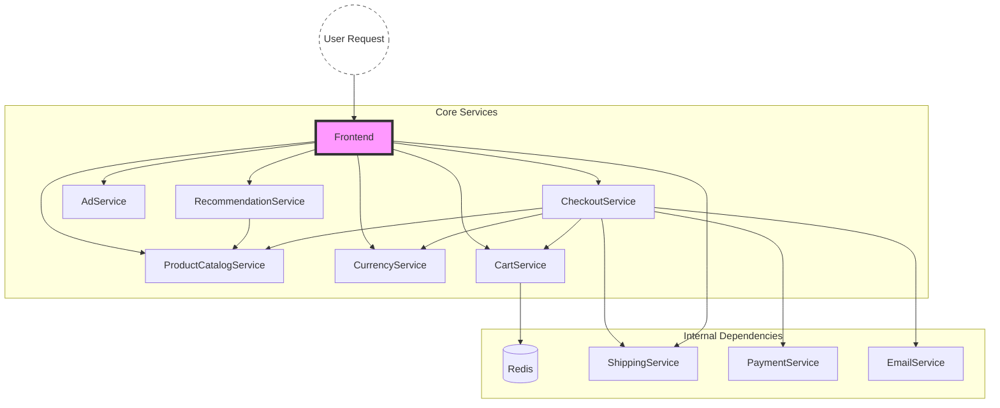

# Model Description: Analytical QN Model of Google Online Boutique

## 1. Introduction

This document describes the Open Queueing Network (QN) model constructed for
the **Google Online Boutique** microservice application. The model represents
each microservice as a service centre and computes steady-state performance
metrics using **Mean Value Analysis (MVA)**.

## 2. System Architecture

Google Online Boutique consists of **11** microservices that process web requests
for an e-commerce application:



## 3. Queueing Network Model

### 3.1 Model Type

- **Open Queueing Network**: External arrivals enter the system and eventually
  depart after being served.
- **Queue Discipline**: First-Come-First-Served (FCFS) at all centres.
- **Queue Type**: M/M/1 (single server, exponential service times, Poisson arrivals)
  for each service centre.

### 3.2 Service Centres

Each microservice is modelled as an independent M/M/1 queue:

| Index | Service Centre          | Service Time S_i (ms) | Description                         |
|-------|------------------------|-----------------------|-------------------------------------|
| 0     | Frontend               | 116.0                 | HTTP server, fan-out to backends    |
| 1     | ProductCatalogService  | 5.0                   | Product data lookup                 |
| 2     | CurrencyService        | 3.0                   | Currency conversion                 |
| 3     | CartService            | 4.0                   | Shopping cart (Redis-backed)        |
| 4     | RecommendationService  | 8.0                   | Product recommendations             |
| 5     | AdService              | 6.0                   | Context-based advertisements        |
| 6     | CheckoutService        | 15.0                  | Checkout orchestration              |
| 7     | ShippingService        | 4.0                   | Shipping cost calculation           |
| 8     | PaymentService         | 10.0                  | Credit card charge (mock)           |
| 9     | EmailService           | 12.0                  | Confirmation email (mock)           |
| 10    | Redis                  | 2.0                   | In-memory key-value store           |

### 3.3 Routing Matrix

The routing matrix **P** defines the probability of a request transitioning
from service centre *i* to service centre *j* after completing service at *i*.
The complement (1 − Σⱼ P[i][j]) represents the probability of exiting the system.

| From \ To      | Frontend | ProdCat | Currency | Cart | Recommend | Ad   | Checkout | Shipping | Payment | Email | Redis |
|----------------|----------|---------|----------|------|-----------|------|----------|----------|---------|-------|-------|
| Frontend       | -        | 0.30    | 0.18     | 0.13 | 0.08      | 0.05 | 0.04     | 0.04     | -       | -     | -     |
| CartService    | -        | -       | -        | -    | -         | -    | -        | -        | -       | -     | 0.95  |
| Recommend.     | -        | 0.80    | -        | -    | -         | -    | -        | -        | -       | -     | -     |
| Checkout       | -        | 0.13    | 0.13     | 0.13 | -         | -    | -        | 0.13     | 0.18    | 0.13  | -     |

All other transitions are zero (services respond without further routing).

### 3.4 External Arrivals

Only the **Frontend** receives external arrivals:

```
λ₀ = [λ, 0, 0, 0, 0, 0, 0, 0, 0, 0, 0]
```

where **λ** is the total external arrival rate in requests per second.

## 4. Solution Method: Mean Value Analysis (MVA)

### 4.1 Traffic Equations

The internal arrival rate at each centre is solved from:

```
λᵢ = λ₀ᵢ + Σⱼ λⱼ · P[j][i]
```

In matrix form: **λ = λ₀ + Pᵀ · λ**, solved as **(I − Pᵀ) · λ = λ₀**

### 4.2 Visit Ratios

The visit ratio Vᵢ represents the average number of visits to centre *i*
per external arrival:

```
Vᵢ = λᵢ / Σₖ λ₀ₖ
```

### 4.3 Utilization

For an M/M/1 queue, the utilization is:

```
ρᵢ = λᵢ · Sᵢ
```

**Stability condition**: ρᵢ < 1 for all *i* (otherwise the queue grows unbounded).

### 4.4 Mean Response Time

For an M/M/1 queue:

```
Rᵢ = Sᵢ / (1 − ρᵢ)
```

This includes both service time and waiting time.

### 4.5 Mean Number in System

By Little's Law:

```
Nᵢ = λᵢ · Rᵢ = ρᵢ / (1 − ρᵢ)
```

### 4.6 End-to-End Response Time

The system response time (end-to-end latency per external request) is:

```
R_sys = Σᵢ Vᵢ · Rᵢ
```

### 4.7 System Throughput

The system throughput equals the total external arrival rate:

```
X_sys = Σₖ λ₀ₖ = λ
```

## 5. Assumptions and Simplifications

1. **Poisson arrivals**: External arrivals follow a Poisson process (reasonable
   for aggregated web traffic).
2. **Exponential service times**: Service times are exponentially distributed
   (simplification — real distributions may be heavier-tailed).
3. **Independence**: Service times are independent across requests and centres.
4. **Steady-state**: The system is in steady-state (workload is stationary).
5. **No resource contention**: Each service centre is modelled independently
   (no CPU/memory sharing effects between co-located services).
6. **Single server per centre**: Each microservice has one instance (can be
   extended to M/M/c for replicated services).
7. **No network delays**: Network latency between services is negligible
   compared to processing time.

## 6. Limitations and Discussion

- **Real service time distributions** may not be exponential. Heavy-tailed
  distributions would lead to higher response times than predicted.
- **Correlated arrivals** (e.g., bursty traffic) violate the Poisson assumption
  and can cause higher queueing delays.
- **Resource contention** in containerized environments (CPU throttling, memory
  pressure) is not captured by this model.
- **Cold start effects** and container scaling delays are not modelled.
- The validation section compares predictions against empirical measurements
  to quantify these modelling errors.
